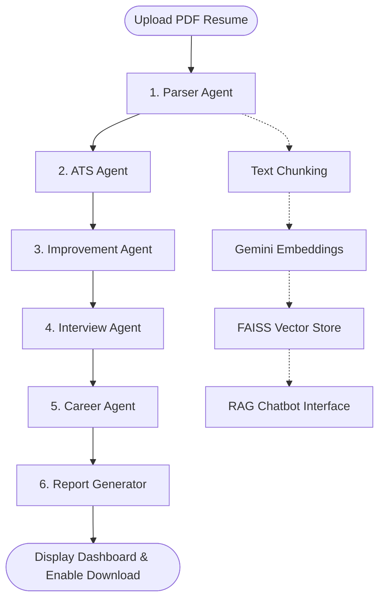

# AI Resume Reviewer Agent

A production-ready, stateful agentic resume review and career advisement system built using **Python**, **Streamlit**, **LangGraph**, **LangChain**, **Google Gemini 2.5 Flash**, and **FAISS**.

This tool parses resumes, computes ATS scores, highlights technical and soft skill gaps, rewrites weak bullet points into high-impact metrics-driven accomplishments, compiles a targeted mock interview preparation package, suggests career roadmaps, and provides an interactive RAG (Retrieval-Augmented Generation) chat capability to quiz and inspect the candidate's resume content.

---

## 🗺️ System Architecture

The workflow is orchestrated sequentially using a **LangGraph StateGraph** to pipeline operations. In addition, uploaded resume content is indexed inside a local **FAISS Vector Store** to enable conversational Q&A.



### Agents & Responsibilities:
1. **Parser Agent (`parser.py`)**: Extracts raw text from the uploaded PDF, normalizes spaces and formatting, and injects clean text into the state.
2. **ATS Agent (`ats_agent.py`)**: Evaluates the resume text against industry standards, calculates an ATS Score (0-100), extracts existing skills, identifies missing keywords, and flags weak sections.
3. **Improvement Agent (`improve_agent.py`)**: Rewrites weak bullet points using action verbs and metrics-driven STAR methodology, and suggests layout/formatting changes.
4. **Interview Agent (`interview_agent.py`)**: Generates tailored questions covering HR/Behavioral, Java, DSA, SQL, and specific questions based on the candidate's projects.
5. **Career Agent (`career_agent.py`)**: Recommends industry certifications, target tech stacks to acquire, and a week-by-week learning roadmap.
6. **Report Generator (`report_generator.py` / `graph.py` node)**: Aggregates all insights into a structured Markdown document.

---

## ⚡ Features

- ✔ **PDF Parsing**: Automated text extraction and cleaning using `PyPDF2`.
- ✔ **ATS Dashboard**: Radial score progress indicator, core strengths, weaknesses, and structure critiques.
- ✔ **Skill Analyzer**: Interactive tag display showing existing vs. missing industry keywords.
- ✔ **Resume Optimizer**: Side-by-side original vs. improved accomplishment statements.
- ✔ **Personalized Interview Prep**: Category-based interview questions (HR, Java, DSA, SQL, Projects) along with preparation tips.
- ✔ **Career Advising**: Tailored certification paths and learning roadmaps.
- ✔ **RAG Resume Chatbot**: Local FAISS vector index allowing users to chat directly with their resume context.
- ✔ **Downloadable Report**: Export the entire analysis as a formatted Markdown file.

---

## 🛠️ Installation & Setup

### Prerequisites
- Python 3.9+
- A Google Gemini API Key (obtained from [Google AI Studio](https://aistudio.google.com/))

### Steps

1. **Clone or Open the Project Directory**:
   ```bash
   cd C:/Users/utkar/.gemini/antigravity/scratch/AI-Resume-Agent
   ```

2. **Create a Virtual Environment** (Optional but recommended):
   ```bash
   python -m venv venv
   # On Windows:
   .\venv\Scripts\activate
   # On macOS/Linux:
   source venv/bin/activate
   ```

3. **Install Dependencies**:
   ```bash
   pip install -r requirements.txt
   ```

4. **Configure Environment Variables**:
   Create a `.env` file in the root directory and add your Google Gemini API Key:
   ```env
   GOOGLE_API_KEY=your_gemini_api_key_here
   ```
   *Note: You can also input the key directly in the Streamlit Sidebar at runtime.*

5. **Run the Application**:
   ```bash
   streamlit run app.py
   ```

---

## 📝 Sample Prompts Used

### ATS Score and Skill Analysis
```python
ATS_ANALYSIS_PROMPT = """
You are an expert ATS (Applicant Tracking System) recruiter and resume analyzer.
Your task is to analyze the following resume text and provide a highly professional, detailed evaluation.

Provide your evaluation EXACTLY in the following JSON format:
{
  "ats_score": <int between 0 and 100>,
  "extracted_skills": [<list of strings>],
  "missing_skills": [<list of strings>],
  "weak_sections": [<list of strings>],
  "strengths": [<list of strings>],
  "weaknesses": [<list of strings>],
  "summary": "<a concise 3-4 sentence professional summary>"
}

Resume Text:
{resume_text}
"""
```

### Interview Questions Generation
```python
INTERVIEW_QUESTIONS_PROMPT = """
You are an expert technical interviewer.
Analyze the following resume and generate tailored interview questions to help the candidate prepare.
You must generate:
1. HR Questions (Behavioral/General)
2. Java Questions (Core Java, OOP, concurrency, collection framework)
3. DSA Questions (Data Structures and Algorithms)
4. SQL Questions (Database queries, Joins, Indexing, Transactions)
5. Project-based Questions (specific to the projects mentioned in the resume)

For each question, provide a short tip on the best approach to answer it.
"""
```

---

## 📂 Project Structure

```
AI-Resume-Agent/
│
├── app.py                      # Streamlit UI & RAG Orchestration
├── requirements.txt            # Project dependencies
├── README.md                   # Project documentation
├── .env.example                # Example configuration
│
├── agents/
│   ├── __init__.py             # AgentState definition and LLM helper
│   ├── parser.py               # Parser Node (PDF Reader)
│   ├── ats_agent.py            # ATS Critique Node
│   ├── improve_agent.py        # Bullet Optimizer Node
│   ├── interview_agent.py      # Interview Prep Generator Node
│   ├── career_agent.py         # Career Roadmap Node
│   └── graph.py                # LangGraph Flow Compilation
│
├── prompts/
│   ├── __init__.py             # Exports all prompts
│   ├── ats_prompt.py           # ATS Agent Prompt
│   ├── improve_prompt.py       # Resume Improvement Prompt
│   ├── interview_prompt.py     # Interview Questions Prompt
│   └── career_prompt.py        # Career Advisor Prompt
│
├── rag/
│   ├── __init__.py
│   ├── embeddings.py           # Google Generative AI Embeddings Setup
│   └── vectorstore.py          # FAISS Vector Indexing & Conversational Chain
│
└── utils/
    ├── __init__.py
    ├── pdf_reader.py           # Text cleaner & extractor utility
    └── report_generator.py     # Markdown compiler utility
```
